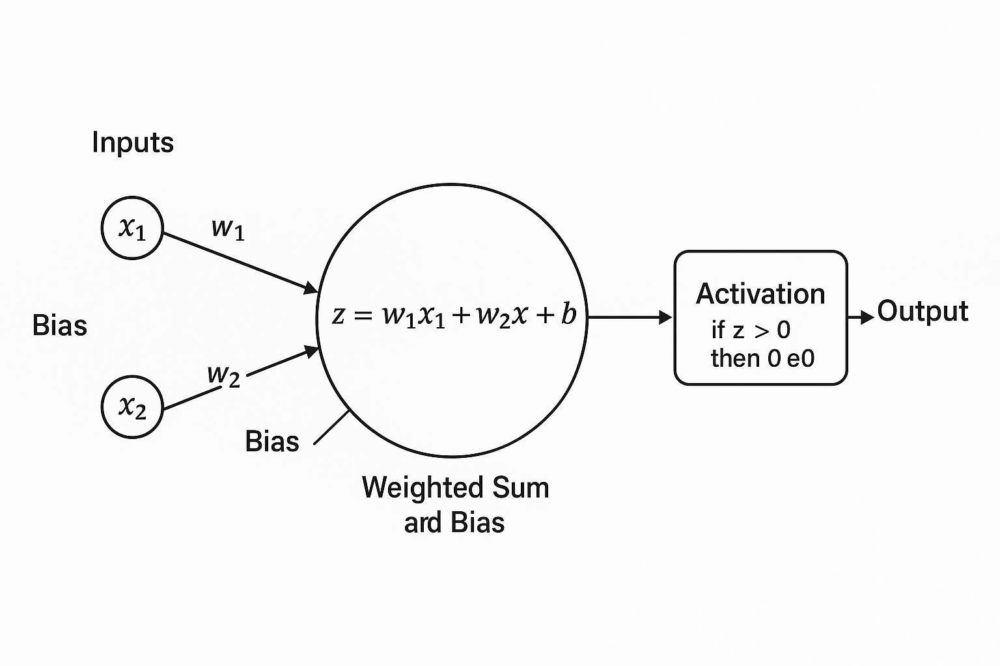

#### **12 June 2025**  
---
## 🔄 What is an Autoencoder?

An **autoencoder** is a type of neural network that learns how to **compress** data (encode it) and then **rebuild** it (decode it). The goal is to learn a useful **representation** of the input data.

---

## 🧠 Structure of an Autoencoder

1. **Encoder**  
   This part takes the input (like an image or a sentence) and converts it into a **smaller, compressed version** — called the **latent representation** or **bottleneck**.

2. **Latent space (bottleneck)**  
   This is the compressed version of the data — a more compact way of expressing the original input. It should keep the important information but discard unimportant details.

3. **Decoder**  
   This part takes the latent code and tries to **reconstruct the original input** as accurately as possible.

---

## 🖼️ Example: Imagine an Autoencoder for Pictures

Let’s say you have a 28x28 image of a handwritten digit (like from the MNIST dataset — 784 pixels total).

- **Encoder**: Compresses the 784-pixel image into just 32 numbers.  
- **Latent space**: Those 32 numbers are a "summary" of the image — the machine’s way of remembering it.  
- **Decoder**: Takes the 32-number summary and tries to rebuild the original 784-pixel image.  

If the output looks very similar to the input, that means the autoencoder learned a good representation.

---

## 🧪 Why Use Autoencoders?

1. **Data compression** – Compress files, images, or sound.  
2. **Denoising** – Remove noise from data (called **denoising autoencoders**).  
3. **Feature learning** – Discover important hidden patterns for classification or clustering.  
4. **Anomaly detection** – Poor reconstruction may signal a “strange” or anomalous input.

---

## 🏗️ Types of Autoencoders

| Type                              | Purpose / Key Idea                                                |
| --------------------------------- | ----------------------------------------------------------------- |
| **Vanilla Autoencoder**           | Basic compress + decompress model                                 |
| **Denoising Autoencoder**         | Learns to reconstruct original input from a **noisy** version     |
| **Sparse Autoencoder**            | Forces most of the latent values to be **zero** (sparse features) |
| **Variational Autoencoder (VAE)** | Learns not just a point but a **distribution** of latent codes    |
| **Convolutional Autoencoder**     | Used for images, uses convolution layers instead of dense layers  |

---

## 💡 Naïve Analogy: Zip and Unzip

- **Input**: A big image file (like a .jpg)  
- **Encoder**: Like zipping the file to make it smaller  
- **Latent Code**: The zipped file (compressed form)  
- **Decoder**: Like unzipping the file to get the original image back  
- **Goal**: Make sure the unzipped image looks very close to the original


---
---
---


## 🤖 Single Perceptron Explained with Two Naive Examples

A **perceptron** is the simplest type of neural network. It makes a decision by:
- taking some inputs,
- multiplying them by weights,
- adding a bias,
- and applying a simple rule (activation function) to decide the output.

The formula looks like this:

```text
z = w1 * x1 + w2 * x2 + ... + wn * xn + b
```

Then we use a **step function**:

```text
if z > 0:
    output = 1
else:
    output = 0
```

---

### ☂️ Example 1: **Should I Carry an Umbrella?**

**Goal**: Decide whether to carry an umbrella based on the weather.

**Inputs**:
- `x1 = 1` → It’s cloudy  
- `x2 = 1` → Rain is predicted

**Weights (how important each factor is)**:
- `w1 = 0.6` → Cloudiness  
- `w2 = 0.9` → Rain forecast

**Bias (natural resistance to carrying umbrella)**:
- `b = -1`

#### 🔢 Calculation:
```text
z = w1 * x1 + w2 * x2 + b
z = 0.6 * 1 + 0.9 * 1 - 1
z = 0.6 + 0.9 - 1 = 0.5
```

#### ⚡ Activation:
```text
if z > 0:
    output = 1 → Bring umbrella
else:
    output = 0 → Don’t bring umbrella
```

✅ **Output**: `1` → Yes, bring the umbrella.

---

### 🏋️ Example 2: **Is This Person an Athlete?**

**Goal**: Decide if someone is likely an athlete based on their height and weight.

**Inputs**:
- `x1 = 1.80` → Height in meters  
- `x2 = 75` → Weight in kilograms

**Weights**:
- `w1 = 5` → Height is very influential  
- `w2 = 0.2` → Weight has smaller effect

**Bias (strictness of what we call an "athlete")**:
- `b = -8`

#### 🔢 Calculation:
```text
z = w1 * x1 + w2 * x2 + b
z = 5 * 1.80 + 0.2 * 75 - 8
z = 9.0 + 15 - 8 = 16.0
```

#### ⚡ Activation:
```text
if z > 0:
    output = 1 → Athlete
else:
    output = 0 → Not an athlete
```

✅ **Output**: `1` → The person is classified as an athlete.

---

### 🧠 Summary:

- A **perceptron** combines weighted inputs and a bias.
- If the total score `z` is above 0, it outputs 1 (positive decision).
- If not, it outputs 0 (negative decision).
- It’s like a very simple “yes/no” decision maker — like a mini brain cell.

These examples help build intuition before moving into **multilayer perceptrons (MLPs)** used in deep learning.




